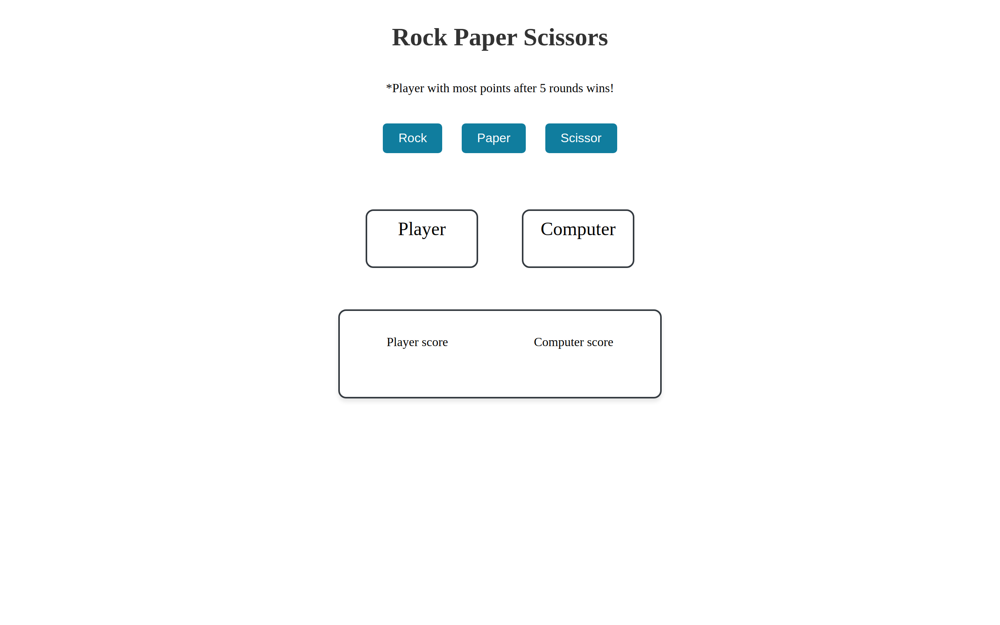

# rock_paper_scissor

:point_right: [live demo](https://cmfernandes.github.io/rock_paper_scissor/) 

---

## About

This project is a classic game of rock, paper, scissors, where the player competes against the computer.

Was build with HTML, CSS and vanilla Javacript.

The main purpose of this project was to practice:
-functions
-condicionals
-DOM manipulation
-event listeners

Assigment from [The Odin Project](https://www.theodinproject.com/lessons/foundations-rock-paper-scissors) Foundations course. 